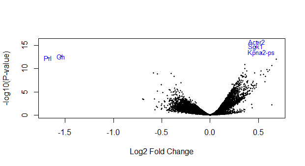
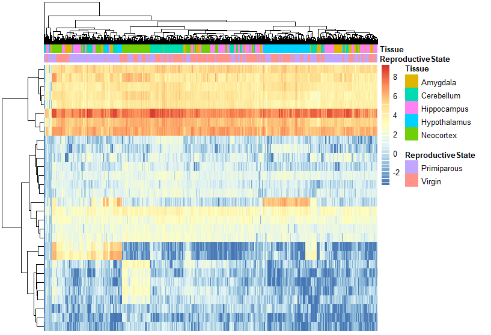

# Introduction

> This project aims apply the knowledge aquired along the module _Análisis de datos de secuenciación masiva_ from the course _Bioinformática y estadística II_.

Here is presented a differential expression analysis performed through R programming language, and some of the libraries. All the analysis here presented was done with the project **SRP181125** and obtained through **recount3**.

## About the data

#### Study title
RNA-seq experiment on five mouse brain regions--hypothalamus, hippocampus, neocortex, cerebellum, and the amygdala --comparing expression in virgin females to primiparous females three weeks after pup weaning.

#### Abstract
RNA-seq experiment on five mouse brain regions-- --comparing expression in virgin females to primiparous females three weeks after pup weaning. For each brain region there are 8 replicates, though three samples were not used in the final analysis based on inspection of PCA plots (1 sample from the Hippocampus, Cerebellum and Amygdala data sets; see details below). Overall design: Comparison of gene expression in five brain regions between eight virgin and eight primiparous females three weeks after pup weaning. Pair-wise comparisons were performed using EdgeR transformed data and Limma Voom for statistical analysis.

| Data | Information |
| ---- | ---- |
| PubMed ID | [31164388](https://www.ncbi.nlm.nih.gov/pubmed/31164388) |
| Publication Title | [Maternal Experience Leads to Lasting Gene Expression Changes in Some Regions of the Mouse Brain.](https://www.ncbi.nlm.nih.gov/pubmed/31164388) |
| Total Samples | 597 |
| Authors | [Arbeitman MN](https://www.refine.bio/search?q=publication_authors%3AArbeitman+MN) |
| Source Repository | [Sequence Read Archive (SRA)](https://www.ebi.ac.uk/ena/data/view/SRP181125) |
| Alternate Accession IDs | [GSE125428](https://www.ncbi.nlm.nih.gov/geo/query/acc.cgi?acc=GSE125428) |

# Explore and Clean Data

The data provides the following **sra_attributes**, all of them had to be changed to be properly handled, here is a table to show how it was done.

| sra_attribute | original type | converted to | values |
| ---- | ---- | ---- | ---- |
| reproductive_state | character | factor | Virgin, Primiparous |
| tissue | character | factor | Neocortex, Hypothalamus, Hippoccampus, Cerebelum, Amygdala |
| source_name | character | factor | Amygdala_Primiparous, Amygdala_Virgin, Cerebellum_Primiparous, Cerebellum_Virgin, Hippocampus_Primiparous, Hippocampus_Virgin, Hypothalamus_Primiparous, Hypothalamus_Virgin, Neocortex_Primiparous, Neocortex_Virgin |
| animal_identification | character | factor | 405, 409, 413, 414, 415, 418, 421, 425, 427, 4486, 4487, 4488, 4489, 4490, 4491, 4493, 27, 37, 40, 44, 33, 38, 39, 33, 38, 39, 35, 39, 43, 36, 40, 36 |
| strain | character | factor | C57BL/6 |

## Data quality

Once with the data ready we proceed to explore if it has quality problems, so we calculate assignation ratios to the genes (assigned_gene_prop) which can provide a point of confidence we give to a gene measuring, and incorporate that information to the data. After that we proceed to visualization.

## Filter Data

The data seems to have good quality, it was intended to retain values above a cutoff of 0.6 because is a good general quality value we could be more exhaustive  but all genes had a value above 0.6 and aiming to conserve equilibrium on the data we didn't cut the data to this point based on quality.

Either way, we looked for low expressed genes that won't benefit the analysis because they'll do noise, it is bad to keep a lot of zeros to the statistic methods. So we calculated gene expression level means (gene_means) and visualize them as a histogram.

As expected too many genes were under low expressed and was hard to see the real nature of the distribution. To provide a bit more information we did the histogram with the log values.

Now we can see that a lot of the log values are negative which means they have expression levels under 1. We cannot continue with that many zero values, they'll produce noise. So we proposed to remove expression levels under 0.1 in order to find relevant things.

After the removal of low expressed genes to the data we retained 52.39%.

## Normalization

To reduce the incidence of false positives we normalize the data assuming the majority of them are not differentially expressed.

# Differential expression

Differential expression analysis is a powerful tool for unraveling a bit on gene regulation and understanding the molecular basis of biological processes on different conditions.

In order to confirm that there are no queality problems with the data conserved were done two boxplots with the main data attributes reproductive state and tissue. And the statistic model was done considering those two attributes.

Then we estimate the mean variance with the log counts from the reads to see the **mean-variance trend**.

We see that the maximum standard deviation is around two for this data. Now we adjust the data for the attribute reproductive_state to examine the statistic results.

We see how the data with respect to the log fold change is pretty static.

In this volanoplot we can see the log fold change in relation with p-values, which is what tell us more about how the data is more differentially expressed.
We can see the five more differentially expressed genes, these being the genes Acer2, Sgk1, Kpna2-ps, Gh and Prl.

## Visualize genes differentially expressed genes

In this heatmap we can see the expression of the genes along different samples, and how they cluster together. 
We could expect to see the cluster forming groups according to the features reproductive status or tissue but to this point there is no clear or strong cluster formation based on the groups seen on the dataset.

We should expect that kind of cluster formation so we think it may need some kind of enrichment or some extra work.

# Conclutions

This tools provide a insight that enable generation of testable hypotheses about the molecular mechanisms underlying biological processes to identify genes or transcripts that are differentially expressed between two or more biological conditions. These hypotheses can then be further explored through experimental validation and additional studies, ultimately advancing our understanding of complex biological systems.
